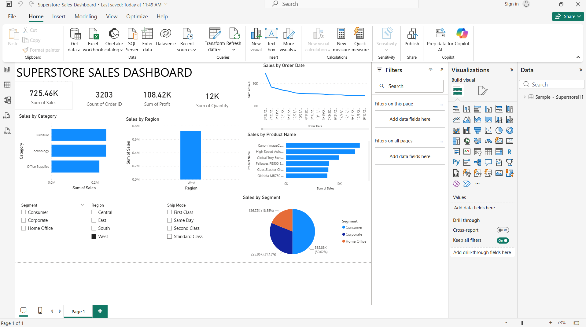

# Superstore Sales Dashboard

## Project Overview
This project is a Power BI dashboard created using the Sample Superstore dataset.

The dashboard provides insights into:
- Total Sales
- Total Profit
- Total Orders
- Total Quantity
- Sales by Category
- Sales by Region
- Sales by Product
- Sales Trend Over Time
- Sales by Segment

## Tools Used
- Power BI Desktop
- Sample Superstore Dataset

## Dashboard Preview

## Files Included
- Superstore_Sales_Dashboard.pbix
- dashboard.png

## Author
Divya Nandhikolla
